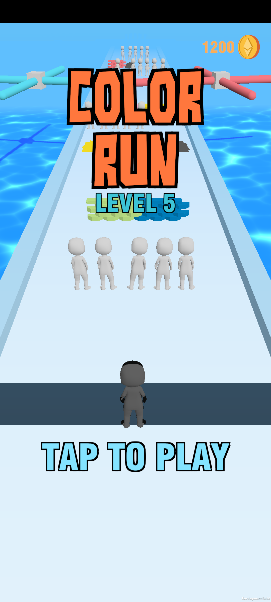

# Color Run
A hypercasual unity game. Match colors to destroy obstacles and get to the end with at little loss as possible.

## Links

* **Google Play link**: https://play.google.com/store/apps/details?id=name.kezzyhko.colorrun
* **HTML5 build on GitHub Pages**: https://kezzyhko.github.io/color-run
* **HTML5 build on itch.io**: https://kezzyhko.itch.io/color-run
* **HTML5 build on VK**: https://vk.com/app7892168
* **HTML5 build files**: https://github.com/kezzyhko/color-run/tree/github-pages
* **.apk build**: https://github.com/kezzyhko/color-run/releases/download/v1.1.1/ColorRun.apk

## Branches

* **`main`**: latest version, fetched from Unity Collaborate, with some additional fixes
* **`original_commits`**: original history of commits copied from the original repository
* **`github-pages`**: web files - html5 build and privacy policy

## Screenshots

